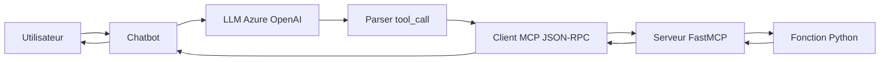

# 🤖 Chatbot FastMCP avec JSON-RPC

Un chatbot intelligent utilisant le protocole **MCP (Model Context Protocol)** avec **FastMCP** et **JSON-RPC** pour communiquer avec trois serveurs spécialisés : calculatrice, gestion de fichiers et gestion d'employés.

## 🎯 Fonctionnalités

### ✨ **Trois Serveurs MCP Spécialisés**
- **🧮 Calculator** : Opérations mathématiques (addition, multiplication, racine carrée, factorielle, etc.)
- **📁 Filesystem** : Gestion complète des fichiers (lecture, écriture, listing, création de dossiers)
- **👥 Employees** : CRUD complet pour la gestion d'employés (création, recherche, statistiques, mise à jour)

### 🔄 **Architecture JSON-RPC Complète**
- Communication via le protocole MCP standard
- Handshake d'initialisation avec chaque serveur
- Gestion robuste des erreurs et timeouts
- Isolation complète des processus serveurs

## 📁 Structure du Projet

```
chatbot-fastmcp/
├── 🤖 chatbot.py              # Chatbot principal avec JSON-RPC
├── 🔧 mcp_client.py      # Client MCP JSON-RPC
├── ⚙️ config.py               # Configuration Azure OpenAI
│
├── 🧮 calculator_server.py    # Serveur FastMCP pour calculs
├── 📁 file_server.py          # Serveur FastMCP pour fichiers  
├── 👥 employee_server.py      # Serveur FastMCP pour employés
│
├── 🧪 test_mcp.py            # Tests unitaires des serveurs
├── 🔍 debug_prompt.py        # Test du prompt LLM
│
├── 📊 employees.json         # Base de données employés (auto-généré)
├── 📋 pyproject.toml         # Dépendances Python
└── 📖 README.md              # Cette documentation
```

## 🚀 Installation

### 1. **Prérequis**
- Python 3.11+
- [uv](https://docs.astral.sh/uv/) (gestionnaire de paquets Python ultra-rapide)
- Compte Azure OpenAI

### 2. **Installation avec uv**
```bash
# Installation d'uv (si pas déjà installé)
curl -LsSf https://astral.sh/uv/install.sh | sh

# Clone et installation du projet
git clone https://github.com/abdelhadi-essabri/AI_Agent_MCP.git
cd AI_Agent_MCP

# Installation des dépendances avec uv
uv pip install mcp langchain-openai aiofiles

# Ou créer un environnement virtuel avec uv
uv venv
source .venv/bin/activate  # Linux/Mac
# .venv\Scripts\activate   # Windows
uv pip install mcp langchain-openai aiofiles
```

### 3. **Configuration**
Créez un fichier `.env` dans le répertoire racine :
```env
AZURE_OPENAI_ENDPOINT=your-endpoint-here
AZURE_OPENAI_API_KEY=your-api-key-here
AZURE_OPENAI_DEPLOYMENT=gpt-4o
AZURE_OPENAI_API_VERSION=2024-02-15-preview
TEMPERATURE=0.7
MAX_TOKENS=2000
```

## ⚡ Pourquoi uv ?

Ce projet utilise **[uv](https://docs.astral.sh/uv/)** comme gestionnaire de paquets pour ses avantages :

### 🚀 **Performance**
- **10-100x plus rapide** que pip pour l'installation
- Résolution de dépendances ultra-rapide
- Cache global intelligent

### 🔒 **Fiabilité**
- Résolution déterministe des versions
- Lock files automatiques
- Environnements virtuels isolés

### 🛠️ **Développement**
```bash
# Installation complète avec dépendances de dev
uv pip install -e ".[dev]"

# Lancer les tests
uv run pytest

# Formater le code
uv run black .
uv run ruff check .

# Type checking
uv run mypy .
```

## 🎮 Utilisation

### 🚀 **Lancement du Chatbot Principal**
```bash
# Avec uv
uv run chatbot.py

# Ou avec Python classique
python chatbot.py
```

### 🧪 **Tests des Serveurs**
```bash
# Test tous les serveurs avec uv
uv run test_mcp.py

# Test individuel
uv run test_mcp.py calculator
uv run test_mcp.py employees  
uv run test_mcp.py filesystem
```

### 🔍 **Debug du Prompt**
```bash
uv run debug_prompt.py
```

## 💬 Démonstration Complète

Voici une session complète du chatbot avec tous les types d'outils :

### 🔌 **Initialisation**
```
🚀 Initialisation du chatbot FastMCP avec JSON-RPC...
🔌 Connexion JSON-RPC au serveur 'calculator'...
🤝 Handshake réussi avec calculator
📋 7 outils trouvés pour 'calculator':
  • add: Addition de deux nombres
  • subtract: Soustraction de deux nombres
  • multiply: Multiplication de deux nombres
  • divide: Division de deux nombres
  • power: Élévation à la puissance
  • square_root: Racine carrée d'un nombre
  • factorial: Factorielle d'un nombre entier
✅ Serveur JSON-RPC 'calculator' connecté

🔌 Connexion JSON-RPC au serveur 'filesystem'...
🤝 Handshake réussi avec filesystem
📋 5 outils trouvés pour 'filesystem':
  • read_file: Lit le contenu d'un fichier
  • write_file: Écrit du contenu dans un fichier
  • list_files: Liste les fichiers d'un répertoire
  • get_file_info: Obtient les informations d'un fichier
  • create_directory: Crée un répertoire
✅ Serveur JSON-RPC 'filesystem' connecté

🔌 Connexion JSON-RPC au serveur 'employees'...
🤝 Handshake réussi avec employees
📋 8 outils trouvés pour 'employees':
  • create_employee: Crée un nouvel employé
  • get_employee: Récupère les informations d'un employé par son ID
  • list_employees: Liste tous les employés avec filtres optionnels
  • update_employee: Met à jour les informations d'un employé
  • delete_employee: Supprime ou désactive un employé
  • reactivate_employee: Réactive un employé désactivé
  • search_employees: Recherche des employés par nom, email, poste ou département
  • get_department_stats: Obtient les statistiques d'un département
✅ Serveur JSON-RPC 'employees' connecté

✅ Chatbot FastMCP avec JSON-RPC initialisé avec succès!
📋 20 outils disponibles au total

💬 Chatbot FastMCP JSON-RPC prêt! Tapez 'quit' pour quitter.
```

### 🧮 **Calculs Mathématiques**
```
👤 Vous: Calcule 15 * 8
🤖 Assistant JSON-RPC: 🔧 Exécution JSON-RPC: calculator.multiply avec {'a': 15, 'b': 8}
Le résultat de 15 * 8 est 120.
```

### 📁 **Gestion des Fichiers**
```
👤 Vous: Crée un fichier test.txt avec Hello World dans C:\Users\xxxx
🤖 Assistant JSON-RPC: 🔧 Exécution JSON-RPC: filesystem.write_file avec {'path': 'C:\\Users\\xxxx\\test.txt', 'content': 'Hello World'}
Le fichier "test.txt" a été créé avec succès dans le répertoire "C:\Users\xxxx" et contient le texte "Hello World".
```

### 👥 **Gestion des Employés**
```
👤 Vous: Donnez la liste des employés?
🤖 Assistant JSON-RPC: 🔧 Exécution JSON-RPC: employees.list_employees avec {}
Voici la liste des employés :

1. **Alice Martin**
   - Email : alice.martin@test.com
   - Poste : Développeuse Senior - IT
   - Salaire : 65,000.00 €
   - Date d'embauche : 2022-01-15
   - Statut : 🟢 Actif

2. **Bob Dupont**
   - Email : bob.dupont@test.com
   - Poste : Chef de Projet - IT
   - Salaire : 75,000.00 €
   - Date d'embauche : 2021-03-10
   - Statut : 🟢 Actif

3. **Carol Bernard**
   - Email : carol.bernard@test.com
   - Poste : Comptable - Finance
   - Salaire : 45,000.00 €
   - Date d'embauche : 2023-06-01
   - Statut : 🟢 Actif

4. **Test User**
   - Email : test.user@example.com
   - Poste : Testeur - QA
   - Salaire : 50,000.00 €
   - Date d'embauche : 2024-01-01
   - Statut : 🟢 Actif

Si vous avez besoin de plus d'informations ou d'une action spécifique, n'hésitez pas à demander !
```

## 🔧 API des Serveurs

### 🧮 **Serveur Calculator**
| Outil | Description | Paramètres |
|-------|-------------|------------|
| `add` | Addition de deux nombres | `a`, `b` |
| `subtract` | Soustraction | `a`, `b` |
| `multiply` | Multiplication | `a`, `b` |
| `divide` | Division | `a`, `b` |
| `power` | Élévation à la puissance | `base`, `exponent` |
| `square_root` | Racine carrée | `number` |
| `factorial` | Factorielle | `n` |

### 📁 **Serveur Filesystem**
| Outil | Description | Paramètres |
|-------|-------------|------------|
| `read_file` | Lit un fichier | `path` |
| `write_file` | Écrit dans un fichier | `path`, `content` |
| `list_files` | Liste les fichiers | `directory` (optionnel) |
| `get_file_info` | Infos sur un fichier | `path` |
| `create_directory` | Crée un dossier | `path` |

### 👥 **Serveur Employees**
| Outil | Description | Paramètres |
|-------|-------------|------------|
| `create_employee` | Crée un employé | `prenom`, `nom`, `email`, `poste`, `departement`, `salaire`, `date_embauche`, `telephone`*, `adresse`* |
| `list_employees` | Liste des employés | `departement`*, `actif_seulement`* |
| `search_employees` | Recherche d'employés | `term` |
| `get_employee` | Détails d'un employé | `employee_id` |
| `update_employee` | Met à jour un employé | `employee_id` + champs à modifier |
| `delete_employee` | Supprime/désactive | `employee_id`, `permanent`* |
| `reactivate_employee` | Réactive un employé | `employee_id` |
| `get_department_stats` | Statistiques | `departement`* |

*Paramètres optionnels

## 🏗️ Architecture Technique

### 🔄 **Flux de Communication**


### 📡 **Protocole JSON-RPC**
```json
{
  "jsonrpc": "2.0",
  "id": "uuid-unique",
  "method": "tools/call",
  "params": {
    "name": "multiply",
    "arguments": {
      "a": 15,
      "b": 8
    }
  }
}
```

### 🔧 **Format Interne tool_call**
```xml
<tool_call>
{"tool": "calculator.multiply", "arguments": {"a": 15, "b": 8}}
</tool_call>
```

## 🛡️ Sécurité et Validation

### ✅ **Validations Implémentées**
- **Employés** : Emails uniques, formats de date, salaires positifs
- **Fichiers** : Gestion des erreurs d'accès et permissions
- **Calculs** : Division par zéro, racines négatives, factorielles négatives

### 🔒 **Sécurité**
- Isolation des processus serveurs
- Validation des entrées côté serveur
- Gestion robuste des timeouts et crashes
- Pas d'exposition directe des données

## 🧪 Tests et Développement

### 🔬 **Tests Unitaires**
```bash
# Test complet avec uv
uv run test_mcp.py

# Exemples de tests individuels
uv run test_mcp.py calculator    # Test calculs
uv run test_mcp.py employees     # Test employés
uv run test_mcp.py filesystem    # Test fichiers
```

### 🐛 **Debug et Monitoring**
```bash
# Test du prompt LLM
uv run debug_prompt.py

# Logs détaillés dans le chatbot
🔍 Réponse LLM complète: <affichage de la réponse>
🔧 Exécution JSON-RPC: server.tool avec {args}
```

## 🚀 Extensions Possibles

### 🌟 **Nouveaux Serveurs**
```python
# Exemple: serveur d'inventaire
from mcp.server.fastmcp import FastMCP

mcp = FastMCP("Inventory Service")

@mcp.tool()
def get_stock(product_id: int) -> str:
    """Récupère le stock d'un produit"""
    return f"Stock: 150 unités"

if __name__ == "__main__":
    mcp.run()
```

### 🔧 **Intégrations**
- Base de données (PostgreSQL, MongoDB)
- APIs externes (météo, finance, etc.)
- Systèmes d'entreprise (ERP, CRM)
- Services cloud (AWS, Azure, GCP)

### 🎨 **Interface Utilisateur**
- Interface web (FastAPI + React)
- API REST pour intégration
- Webhooks et notifications
- Dashboard de monitoring

## 📈 Performances

### ⚡ **Optimisations**
- Communication asynchrone
- Pool de connexions
- Cache des résultats
- Parallélisation des appels

### 📊 **Métriques**
- Temps de réponse : ~100-500ms par outil
- Throughput : ~10-50 requêtes/seconde
- Mémoire : ~50-100MB par serveur
- CPU : Minimal en idle

## 🤝 Contribution

### 🔧 **Développement**
1. Fork le projet
2. Créez une branche feature
3. Ajoutez des tests
4. Soumettez une Pull Request

### 📝 **Standards**
- Code Python 3.11+
- Type hints obligatoires
- Docstrings pour toutes les fonctions
- Tests unitaires pour nouvelles fonctionnalités

## 📞 Support

### 🐛 **Problèmes Courants**
1. **Erreur de connexion serveur** : Vérifiez que Python est dans le PATH
2. **Échec du handshake** : Vérifiez les versions MCP
3. **LLM ne génère pas tool_calls** : Vérifiez la configuration Azure OpenAI
4. **Timeout JSON-RPC** : Augmentez les timeouts dans le client

### 📚 **Ressources**
- [Documentation MCP](https://spec.modelcontextprotocol.io/)
- [Langchain Documentation](https://python.langchain.com/)
- [Azure OpenAI Service](https://azure.microsoft.com/en-us/products/ai-services/openai-service)

## 📄 Licence

MIT License - Voir le fichier `LICENSE` pour plus de détails.

---

**🎉 Projet développé avec MCP, JSON-RPC et Azure OpenAI** 

*Un exemple complet d'architecture MCP moderne pour l'intégration d'outils avec des LLMs* 🚀